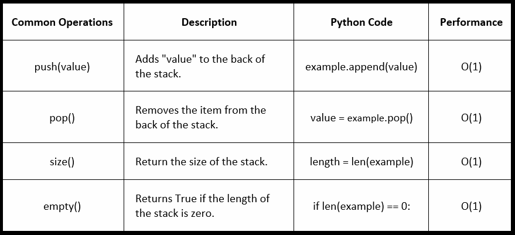

# **Stacks: Last in First Out**

We use stacks all the time in Python. In the background, Python also uses stacks. I'm sure you've used stack tracing to debug your code.

A stack is a data structure in Python that describes the order in which items are added and removed. In a stack, the last item put into the list is the first item out.

---

## **Like Pancakes**

Imagine a stack of pancakes. As you make the pancakes, you stack them up on a plate. People come up and take the top, freshest pancake off the stack. This is essentially how stacks in Python work. If you make pancakes too quickly, the pancakes at the bottom will get cold because they are not being removed off the top.

Look at this code example. What numbers will be left?

```python
pancakes = []

pancakes.append(1)
pancakes.append(2)
pancakes.append(3)
pancakes.append(4)

pancakes.pop()
pancakes.pop()
```
So we create an empty array of pancakes. Then we add 1, 2, 3, and 4. Then we pop off the last two items, leaving us with 1 and 2.

```python
pancakes = []

pancakes.append(1) # 1
pancakes.append(2) # 1, 2
pancakes.append(3)  # 1, 2, 3
pancakes.append(4) # 1, 2, 3, 4

pancakes.pop() # 1, 2, 3
pancakes.pop() # 1, 2
```

---

## **The "Undo" Option**
Another good example of stacks is the "undo" option in a text editor. We've all pressed that back arrow or spammed "crtl + z" to undo the mistake (or mistakes) we have made.

Let's have a look at what happens when we type in a word document.


Uh-oh! We have a typo. Let's press ctrl + z, or "pop" the item off the stack.


Let's do it again.. We need to get to our typo!


Let's do it again.. We need to get to our typo!


There we go. Now we need to "push" items back onto our stack. This time spelled correctly!


What would our word document look like in python? Take a second to ponder this before looking at the code example below.
```python
sentence = []

sentence.append("This")
sentence.append("is")
sentence.append("me")
sentence.append("typing")
sentence.append("a")
sentence.append("sentence")
sentence.append("and")
sentence.append("I")
sentence.append("am")
sentence.append("bad")
sentence.append("at")
sentence.append("spelng")
sentence.append("it")
sentence.append("seems!")

sentence.pop() # removes "seems!"
sentence.pop() # removes "it"
sentence.pop() # removes "spelng"

sentence.append("spelling")
sentence.append("it")
sentence.append("seems!")
```

---

## **Operations**
Here are some common stack operations in python. In python, the most common stack we use is a list. As you can see, stack operations are relatively fast, all with a performance of O(1). We can push a value onto the stack (append an item onto a list), pop an item off the back of the stack (pop item off the back of a list), get the size of the stack (get the length of a list), and check whether or not our stack is empty (check if the length of our list is zero).



---
## Example: Text Inverter

In the example below, we will write a program utilizing our knowledge of stacks that will return the inverse of a given string. Before we begin coding, we should first think about the requirements for our code. What do we want our code to do?

Text Inverter Requirements:

* Accepts inputs of different lengths
* Returns the inverse of any string, last string first and first string last
* Functions even when the string has spaces
* Only operates with strings

```python
def invert(text):
    # First, let's convert the incoming string to an array.
    # This will allow us to more easily use stacks.
    text_array = []
    for letter in text:
        text_array.append(letter)
        
    # Next, create a placeholder string to return 
    # the inverted result.
    result_string = ""
    while len(text_array) > 0:
        # Pop off the last item of the array, and add it to 
        # our inverted string.
        result_string += text_array.pop()
    return result_string

print(invert("racecar"))
print(invert("ham"))
print(invert("potatoes"))
print(invert("python"))
print(invert("This is a test!"))
```
Note the use of stacks. We take the last item off the back of the given string and use it to create a new string. We repeat this process until we can a new, inverted string.

If you want to look at the actual python file and mess around with it, click [here](./python/invert_sentence.py).


---

## Problem to Solve: Create a Stack Class

Now it's time for you to practice stacks on your own. Using your new knowledge, create a Python class for stacks. This class should have the following definitions: display, getSize, isEmpty, push, and popOff. Display will print everything in the stack to the console. The next definition, getSize, will return the size of the stack (number of items in the stack) as a number. The next function, isEmpty, will return True or False based off whether or not the stack is empty (has zero items). The definition for push will add a given value to the back of the stack. Finally, popOff will remove the last item from the stack.

* Test 1: Push three items to your stack using your push definition.
* Test 2: Display your stack using the display function.
* Test 3: Check the size before and after removing the last item from the stack.
* Test 4: Check if the stack is empty before and after removing all items from the stack
* Test 5: Remove all items from stack and try and remove an item from an empty stack. Make sure you have error handling!

Use the following code test cases to test your Class.

```python
stack = Stack()
print("Added: " + stack.push("Pancake 1")) # Added: Pancake 1
print("Added: " + stack.push("Pancake 2")) # Added: Pancake 2
print("Added: " + stack.push(3)) # Added: 3
stack.display() # ['Pancake 1', 'Pancake 2', 3]
print("Size: " + str(stack.getSize())) # Size: 3
print("Removed: " + str(stack.popOff())) # Removed: 3
print("Size: " + str(stack.getSize())) # Size: 2
print("Is Empty: " + str(stack.isEmpty())) # Is Empty: False
print("Removed: " + str(stack.popOff())) # Removed: Pancake 2
print("Removed: " + str(stack.popOff()))# Removed: Pancake 1
print("Removed: " + str(stack.popOff())) # Removed: Popping from an empty stack. Cannot complete task.
print("Is Empty: " + str(stack.isEmpty())) # Is Empty: False
```
Try the code on your own before checking the solution. If you need a starting point, use the following code here: [Starting Point](./python/stack_class_start.py)

You can check your code with the solution here: [Solution](./python/stack_class_solution.py)


[Back to Welcome Page](0-welcome.md)