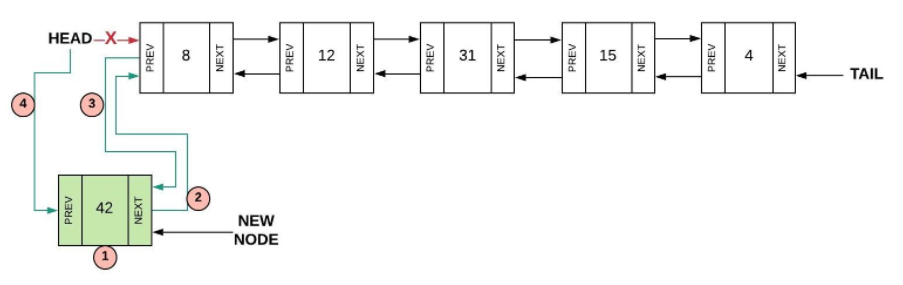

# **Linked Lists**
In Python, a Linked List is similar to an array. It's a way to store a collection of information. However, unlike an array, a linked list stores its information randomly in memory. Each element in a linked list stores a piece of information randomly in memory, then also holds a reference pointing to the next item in the linked list.

## **Linked List Syntax**
A link list is comprized of nodes. Each node stores a value (our information) and a link to the next node in the list. This link will point to the next node's memory location so we can keep our list all together.


In the visualization above, we can better see what makes up a linked list. The start of the linked list is known as the head. This is the start, or beginning of our list. It's similar to index zero in a dynamic array. We can also see our nodes, which contain our value and pointer to the next node.

This could be useful for navigating a list, but how can we go backwards? Once we move forward in the list we have nothing pointing us back to where we once were. We get stuck if we want to go backwards in this linked list.

**Doubly Linked Lists**

This is where doubly linked lsits come in. In addition to everythin a normal linked list has, they store a secondary pointer that points to the previous node. So instead of storing a value and one pointer, a doubly linked list will store a value and two pointers. One pointer will point to the next node, and the second will point to the previous node. 


On a doubly linked list, we have a head and a tail. The head is the beginning or starting node in the list. The tail is the end node in the list. These endpoints help us keep track of our list.

---
## **Inserting Into a Linked List**
Inserting a new node into a linked list can be a bit more complicated. You have to add the new value, point to the previous and next values for the new node, and update the existing nodes you inserted the node next to.

**Inserting into the Head**

1. Create a new node
2. Set the "next" pointer of the new node to the current head
3. Set the "previous" pointer of the current head to the new node
4. Set the head equal to the new node



**Inserting into the Tail**

1. Create a new node
2. Set the "previous" pointer of the new node to the current tail
3. Set the "next" pointer of the current tail to the new node
4. Set the tail equal to the new node


**Inserting into the Middle**

1. Create a new node
2. Set the "previous" pointer of the new node to the current node
3. Set the "next" pointer of the new node to the next node of the current node
4. Set the "previous" pointer of the "next" node after the current node to the new node
5. Set the next of the current node to the new node


**Practice**

That was a lot of information to digest. Let's go over what this might look like in code. First, let's code out how to insert into the head of a linked list. Let's imagine we have a class for LinkedList and a class for Node.
```python
import LinkedList
import Node

#Step 1: Create new node
new_node = LinkedList.Node(value)

# Step 2: Connect new node to the previous head
new_node.next = self.head
# Step 3: Connect the previous head to the new node 
self.head.prev = new_node
# Step 4: Update the head to point to the new node
self.head = new_node 
```
Wait, let's pause to think. What if we're inserting in an empty linked list? This code won't work for that. Let's examine how to handle that case.

```python
import LinkedList
import Node

#Step 1: Create new node
new_node = LinkedList.Node(value)

# If the list is empty, then point both head and tail
# to the new node.
if self.head is None:
    self.head = new_node
    self.tail = new_node

# If the list is not empty, then only self.head will be
# affected.
else:
    # Step 2: Connect new node to the previous head
    new_node.next = self.head
    # Step 3: Connect the previous head to the new node 
    self.head.prev = new_node
    # Step 4: Update the head to point to the new node
    self.head = new_node 
```

Take a moment to brainstorm how you might code out inserting a new node to the tail of a linked list. After thinking it through, go ahead and look at the next code example. Did you remember the handle the case of an empty Linked List?

```python
import LinkedList
import Node

# Create the new node
new_node = LinkedList.Node(value)  
        
# If the list is empty, then point both head and tail
# to the new node.
if self.head is None:
    self.head = new_node
    self.tail = new_node
# If the list is not empty, then only self.tail will be
# affected.
    else:
    new_node.prev = self.tail
    self.tail.next = new_node
    self.tail = new_node
```

Take a moment to think about how we might code inserting into the middle of a linked list. How would we handle the case of an empty linked list? Let's say we're inserting after a certain node.

```python
# Search for the node that matches 'value' by starting at the head of the list.
    curr = self.head
    while curr is not None:
        if curr.data == value:
            # If the location of 'value' is at the end of the list,
            # then we can call insert_tail to add 'new_value'
            if curr == self.tail:
                self.insert_tail(new_value)
            # For any other location of 'value', need to create a 
            # new node and reconenct the links to insert.
            else:
                # Step 1: Create a new node
                new_node = LinkedList.Node(new_value)
                # Step 2: Connect new node to the node containing 'value'
                new_node.prev = curr 
                # Step 3: Connect new node to the node after 'value'      
                new_node.next = curr.next
                # Step 4: Connect node after 'value' to the new node  
                curr.next.prev = new_node 
                # Step 5: Connect the node containing 'value' to the new node 
                curr.next = new_node       
                return # We can exit the function after we insert
            curr = curr.next # Go to the next node to search for 'value'
```

---
## **Removing From a Linked List**
Now let's go over the step to remove items from a linked list. Unlike the last section, we will combine the steps and the code syntax together. The example problem and practice problem at the end will help you if you are still struggling with the coding syntax.

The basic steps of removal are to delete the selected node, and update the next and previous nodes to point at eachother.

**Removing from Head**

1. Set the "previous" pointer of the second node to None (self.head.next.prev = None)
2. Set the second node to be the new head (self.head = self.head.next)
3. Delete the old head


**Removing from Tail**

1. Set the "next" pointer of the of the second to last node to none (self.tail.prev.next = None)
2. Set the tail to be the second to last node (self.tail = self.tail.prev)


**Removing from Middle**

1. Set the "previous" pointer after the current node to before the current node (current.prev.next = current.prev)
2. Set the "next" pointer of before the current node to the node after the current node (current.prev.next = current.next)


---
## **Accessing From a Linked List**
When we want to access from a linked list, we must loop through the list until we find the appropriate node. If we want the third node, we must loop through to the third spot. If we want the fifth node, we must loop through to the fifth spot. Some ways to speed up this process is to start from the head and the tail and search to find it. If our node is towards the end, the tail loop will find it faster.

Here's a basic way to traverse a linked list, going forwards and backwards.
```python
def iter(self):
    # Start at the begining
    curr = self.head  
    while curr is not None:
        print(curr.data)  # Do something with the data
        curr = curr.next # Go forward in the linked list

def reversed(self):
    # Start at the end since this is a reverse iteration.
    curr = self.tail  
    while curr is not None:
        print(curr.data)  # Do something with the data
        curr = curr.prev # Go backwards in the linked list
```

---
## **Performance**
Python has a linked list available for use known as deque. To use it, you'll have to *import dequeque* and declare your list through *list = deque().* The following graphic anaylzes the performance of *deque()* in python.


---

## **Common Errors to Watch Out For**

Remember a linked list and a doubly linked list are different. In a normal, not doubly linked list, you cannot traverse backwards, only forwards. In a doubly linked list, you can traverse back and forth as you please. Also remember that whenever you add or delete from a linked list, you must update the surrounding pointers. If you forget to update a pointer, you might be pointing to a blank space in memory since that item was deleted!

---
## **Example Problem: Remove Function**
In the example below, we will write some code to remove a value from our linked list. The function should search the list until it finds the given value, then remove it. Take a moment to think about how you'll solve the problem then look at the solution.

Remove Function Requirements:
* Can remove from tail
* Remove tail should be a seperate function
* Can remove from head
* Remove from head should be a seperate function
* Can remove from middle
* Removes given input value

```python
import LinkedList
import Node

def remove(self, value):
    current = self.head
     # Loop until we have reached the end (None)
    while current is not None:
        # Do something with the current node
        if current.data == value: 
            if current.next is None:
                # If we're at the end, just use the remove tail function.
                self.remove_tail()
                return
            elif current.prev is None:
                # If we're at the beginning, just use the remove head function.
                self.remove_head() 
                return
            else: #Otherwise, remove node from the middle
                current.next.prev = current.prev 
                current.prev.next = current.next
                return
        # Follow the pointer to the next node
        current = current.next

def remove_tail(self):
    # If the list has only one item in it, then set head and tail 
    # to None resulting in an empty list.  This condition will also
    # cover an empty list.  Its okay to set to None again.
    if self.head == self.tail:
        self.head = None
        self.tail = None
        # If the list has more than one item in it, then only self.tail
        # will be affected.
    elif self.head is not None:
        self.tail.prev.next = None  # Disconnect the second to last node from the last node
        self.tail = self.tail.prev  # Update the tail to point to the second to last node
    
def remove_head(self):
    # If the list has only one item in it, then set head and tail 
    # to None resulting in an empty list.  This condition will also
    # cover an empty list.  Its okay to set to None again.
    if self.head == self.tail:
        self.head = None
        self.tail = None
    # If the list has more than one item in it, then only self.head
    # will be affected.
    elif self.head is not None:
        self.head.next.prev = None  # Disconnect the second node from the first node
        self.head = self.head.next  # Update the head to point to the second node
```

---
## **Problem to Solve: Add two Values of Linked List**

Now its time for you to use your new knowledge on Linked Lists. Using this knowledge, you will take one linked list and add together two values from within the list. The user will specify the positions to add together, for example, add together the nth and kth nodes. Your program should loop through the list (already provided to you) until it finds the corresponding nodes, add them together, and return the result. Assume the first node is a link list is position one, the second would be position two, and so on.

We will be providing you with some basic code to help you get started. See the starting code file here: [linked_list_start.py](./python/linked_list_start.py)

Starting with the following linked list, [5, 4, 3, 7, 2, 6, 1], run the following tests below to see if your solution is working.

* Test 1: Add positions 1 and 3 together. This should equal 8.
* Test 2: Add positions 3 and 5 together. This should equal 5.
* Test 3: Add positions 2 and 4 together. This should equal 11.
* Test 4: Add positions 5 and 6 together. This should equal 8.

Use the following code test cases to test your solution.

```python

ll = LinkedList()
ll.insert_tail(1)
ll.insert_head(6)
ll.insert_head(2)
ll.insert_head(7)
ll.insert_head(3)
ll.insert_head(4)
ll.insert_head(5)
print(ll)
print(ll.add_values(1, 3))
print(ll)
print(ll.add_values(1, 3)) #8
print(ll.add_values(3, 5)) #5
print(ll.add_values(2, 4)) #11
print(ll.add_values(5, 6)) #8
```

Once you have given this problem an honest attempt, have a look at the solution: [linked_list.py](./python/linked_list.py).

[Back to Welcome Page](0-welcome.md)
