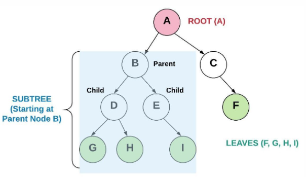
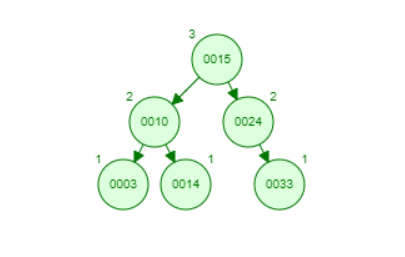
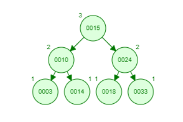
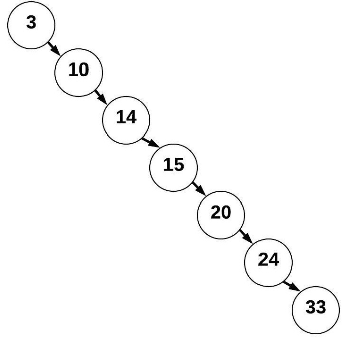
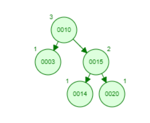
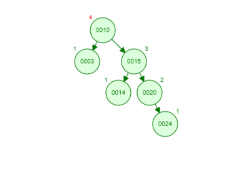
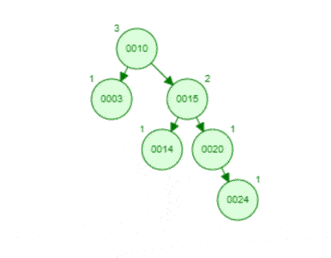
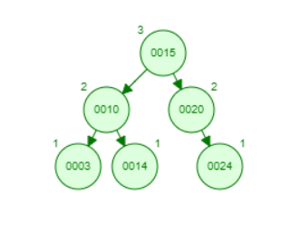
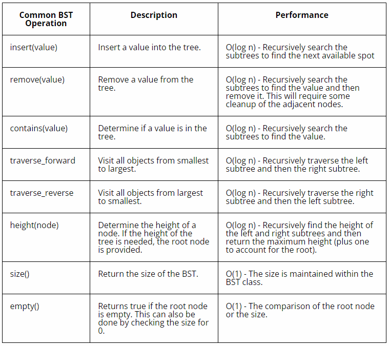

# **Trees**

Trees are similar to linked lists. It has nodes linked together like pointers. However, unlike a linked list, one tree node can connect to multiple nodes. Instead of being a line or a list, a tree is structured more like how you might expect a family tree to appear, with a trunk, branches, and leaves sprouting off.

## **Binary Trees**

A binary tree is a tree that links to only one or two other nodes (hence the name, binary).



Let's examine the above image and establish some definitions. The top node is known as the root node (node A). The nodes at the bottom that don't link to any other nodes (nodes F, G, H, and I) are known as leaf nodes. Nodes that are linked to other nodes (such as B and C) are known as parent nodes. The nodes that are connect to the parent nodes (D and E for the B node) are known as child nodes. The collection of nodes to the left or right of any parent node form a subtree, or a tree within a tree. The data is put into the tree by comparing the data to the parent node. For example, if the data being added is less than the parent node, it would be put to the left. If the data was greater than the parent node, it would be put to the right. Depending on the binary search tree, duplicates might be allowed. In the case of allowing duplicates, the duplicate can go on either side of the subtree.

---
## **Binary Search Tree (BST)**

A binary search tree follows the same definition as a binary tree, with a few more rules to follow. A binary search tree follows rules for how to put data into the tree.



Let's do some practice using the above image. Let's say we want to insert the number 18 to our tree. Starting at the root, is 18 more or less than 15? It's more, so we go to the right subtree. Now, is 18 more or less than 24? It's less, so we go to the left. Since there is an empty space here, we can insert 18 into the empty spot.



This was a very effecient process for inserting into the tree. With each decision, left or right, we eliminate a whole subtree until we reach the end. This is because our binary search tree was balanced.

---
## **Balanced vs. Unbalanced**

The definition of a balanced binary search tree is a BST whose any two subtrees are not dramatically different heights (the difference in height is less than or equal to two). The height of a tree is the maximum number of nodes between the leaves and the root node. The height of a subtree would be the maximum number of nodes between the parent node and the parent node's leaves.

So far, all of the trees we have looked at have been balanced. They've had relatively equal subtree heights. For comparison, let's have a look at an unbalanced BST.



This tree is very unbalanced. All the nodes are on the right side, with nothing over on the left. This BST looks more similar to our linked lists from the past lesson than a tree. Searching and adding nodes to this unbalanced tree would be  more ineffecient than a balanced tree.

You can take an unbalanced tree and rotate it to make it balanced. Let's have a look at this tree below. So far it's balanced. What happens when we insert a 24 though?



We start at the root. 24 is greater than 10, let's go to the right. 24 is greater than 15, let's go to the right. 24 is also greater than 20, let's go to the right. We're at an empty space, so let's insert the 24 here. Look at the image below for the result.



Uhoh, now we can see our tree is unbalanced. We have a subtree with the height of one and subtree with a height of 4 (shown in red). We should rotate our tree to make it balanced. Watch the following gif to see a rotation.



Rotating takes reassigning pointers and reassigning the root node. To see the final, balanced tree after a rotation, look at the image below.



Now we have 15 as our root node and both subtrees have a height of 2. Our tree is nice and balanced now!

---

## **Operations**

Operations for a BST can be quite complicated. Let's look at inserting into a BST. Remember the example problem form earlier. You keep going left or right until you find an empty node. Then you will create a new node, set its value, and update the previous node's (right or left, accordingly) pointer.

We traverse a BST using an iter function. You should use recursion to yield each node and make sure to navigate through each node.

---

## **Performance**

Sadly, Python does not have a built in BST class. However, you can create your own. There are also various packages you can install to help you create your own BST. The following table goes over some common operations for BSTs and their performance.



---

## **Common Errors to Watch Out For**

Remember, for each tree there can be only one root node! A tree can have multiply parent nodes, subtrees, leaves, and child nodes, but it can only have one root node.

---

## **Example Problem: Contains**

In the example problem below, we will write a function to search through a BST to see if it contains a certain value. Our function will either return True or False based off of whether or not it finds the value.

Requirements:

* Return True of False (Did it find the value?)
* Traverses the BST using recursion
* Uses python's \_\_contains__ keyword to allow the use of the "in" keyword

Take a second to think about how you might code this out. 

Hint: Consider using `yield` and `\_\_contains__`.

```python
# This function is recongized by python. It will allow you to use the "in" keyword.
def __contains__(self, data):
        return self._contains(data, self.root)  # Start at the root
    def _contains(self, data, node):
        if data == node.data:
            # If we have this info, return true!
            return True
        else:
            if data < node.data:
                # The data belongs on the left side.
                if node.left is None:
                    # We found an empty spot, so it doesn't exist here.
                    return False
                else:
                    # Need to keep looking.  Call _contains
                    # recursively on the left sub-tree to keep looking.
                    result = self._contains(data, node.left)
            else:
                # The data belongs on the right side.
                if node.right is None:
                    # We found an empty spot, so it doesn't exist here.
                    return False
                else:
                    # Need to keep looking.  Call _contains
                    # recursively on the right sub-tree to keep looking.
                    result = self._contains(data, node.right)
            return result
```

---
## **Problem to Solve: Insert & Reversed**

In this problem, you will create an insert function and a reversed function. The insert function will allow you to create and insert into a BST. You will pass in a value and the insert will sort through where that value should go. You will create a forward traversal (or reuse some of the example) to print and display the tree from smallest to biggest. The reversed function will display the values from largest to smallest.

Requirements:
* A working insert function that does not allow duplicates
* A working traversal function that allows the tree to be displayed from smallest to largest value.
* A working reversed functionn that allows the tree to be displayed in reversed from largest or smallest value.

We will be providing you with some basic code to help you get started. See the starting code file here: [trees_start.py](./python/trees_start.py).

Test Cases:

* Test 1: Insert 6, 3, 3, 6, 7, 8, and 4
* Test 2: Print the tree (forwards, smallest to largest). This should show 3, 4, 6, 7, 8.
* Test 3: Print the reversed tree (largest, to smallest).This should show 8, 7, 6, 4, 3.

Once you have given this problem an honest attempt, have a look at the solution: [trees_solution.py](./python/trees_solution.py).

[Back to Welcome Page](0-welcome.md)